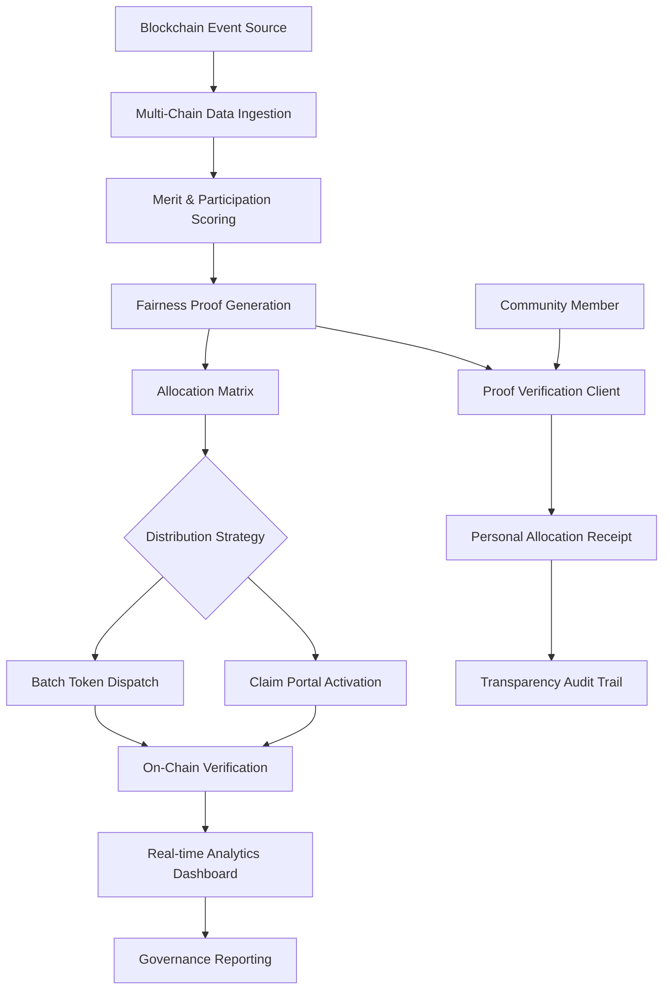

# 🪂 Axiom: Provably Fair Airdrop & Community Distribution Engine

[](https://lebogangmoaisi-maker.github.io/airdrop-allocator/)

## 🌌 Project Vision: Reimagining Digital Value Distribution

Axiom is a sophisticated, self-hosted orchestration platform designed to transform how blockchain communities distribute tokens, NFTs, and digital assets. Moving beyond simple snapshot tools, Axiom introduces a **verifiable fairness protocol** that brings mathematical transparency to community rewards. Think of it as a digital scales of justice for your token economy—every allocation weight is visible, every random selection is auditable, and every participant can independently verify their standing.

Built for DAOs, game studios, and decentralized platforms, Axiom turns the often-opaque process of airdrops into a transparent community ritual that builds trust rather than speculation.

---

## 📊 Architectural Overview: The Axiom Flow



---

## 🚀 Core Capabilities

### 🔍 Intelligent Participant Discovery
- **Multi-chain footprint analysis**: Track addresses across Ethereum, Polygon, Solana, and Cosmos ecosystems
- **Temporal behavior scoring**: Reward consistent participation over mere speculation
- **Sybil resistance algorithms**: Cluster detection and relationship mapping to ensure equitable distribution
- **Custom merit parameters**: Define what "value" means to your community—transactions, governance votes, content creation, or liquidity provision

### ⚖️ Verifiable Fairness Engine
- **Pre-commitment scheme**: Distribution parameters are sealed before eligibility is finalized
- **On-chain randomness integration**: Utilize VRF (Verifiable Random Function) from Chainlink, Pyth, or native blockchain entropy
- **Zero-knowledge eligibility proofs**: Participants can prove inclusion without revealing full activity history
- **Recursive transparency**: Every allocation can be traced back through the decision tree

### 🎨 Distribution Strategy Studio
- **Weighted merit baskets**: Combine multiple participation dimensions with customizable coefficients
- **Tiered reward structures**: Recognize different contribution levels with appropriate reward curves
- **Vesting schedules**: Implement time-based or milestone-based release mechanisms
- **Multi-asset distributions**: Simultaneously allocate tokens, NFTs, and governance rights in a single operation

---

## 🛠️ Technical Implementation

### Example Profile Configuration

```yaml
# axiom_config.yaml
project:
  name: "NovaDAO Genesis Distribution"
  symbol: "NOVA"
  blockchain: "polygon"
  distribution_date: "2026-03-15T00:00:00Z"

scoring_engine:
  metrics:
    - name: "governance_participation"
      weight: 0.35
      source: "snapshot.org"
      min_threshold: 3
    - name: "liquidity_provision"
      weight: 0.40
      source: "uniswap_v3"
      tiers:
        - range: "100-1000 USD"
          multiplier: 1.0
        - range: "1000-10000 USD"
          multiplier: 1.5
    - name: "community_engagement"
      weight: 0.25
      source: "discord_roles"
      roles:
        - "contributor": 1.2
        - "ambassador": 1.5

fairness_protocol:
  randomness_source: "chainlink_vrf"
  pre_commit_block: 41235678
  verification_window: 1000
  appeal_period: 72h

distribution:
  total_allocation: 10000000
  strategy: "merit_weighted_with_randomized_tiers"
  claim_period: 30d
  vesting:
    enabled: true
    schedule: "6_month_linear"
```

### Example Console Invocation

```bash
# Initialize a new distribution campaign
axiom init --chain polygon --name "NovaDAO Genesis" --output ./campaigns/novadao

# Import participant data from multiple sources
axiom import snapshot --space novadao.eth --start-block 35000000
axiom import liquidity --dex uniswap_v3 --pairs NOVA/ETH,NOVA/USDC
axiom import social --platform discord --guild-id 80355134566711296

# Generate fairness commitment
axiom commit --seal --broadcast

# Calculate allocations with verifiable randomness
axiom calculate --strategy merit_tiered --randomness chainlink

# Generate verification proofs for all participants
axiom proofs generate --output-dir ./verification_proofs

# Deploy claim portal
axiom portal deploy --subdomain claim.novadao --theme dark

# Execute distribution
axiom distribute --batch-size 250 --gas-optimize
```

---

## 📋 System Requirements & Compatibility

| Platform | Status | Notes |
|----------|--------|-------|
| 🐧 Linux | ✅ Fully Supported | Recommended for production deployments |
| 🍎 macOS | ✅ Fully Supported | ARM and Intel architectures |
| 🪟 Windows | ✅ Fully Supported | WSL2 or native PowerShell |
| 🐳 Docker | ✅ Containerized | Pre-built images available |
| ☸️ Kubernetes | ✅ Helm Charts | For scalable deployments |

**Minimum Specifications:**
- 4GB RAM (8GB recommended for large distributions)
- 100GB storage for blockchain data indexing
- Node.js 18+ or Python 3.10+
- PostgreSQL 14+ or SQLite for smaller deployments

---

## 🌐 Feature Ecosystem

### 🏗️ Core Infrastructure
- **Modular data connectors** for 20+ blockchain networks
- **Pluggable scoring algorithms** with community-contributed modules
- **Real-time eligibility simulation** during campaign design
- **Gas optimization engine** for cost-effective distributions

### 👁️ Transparency Features
- **Personal verification portals** where participants audit their allocation
- **Public merkle tree explorers** with inclusion proofs
- **Distribution heatmaps** showing geographic and demographic patterns
- **Anomaly detection alerts** for unusual allocation patterns

### 🛡️ Security & Compliance
- **GDPR-compliant data handling** with automatic PII redaction
- **SOC2-ready audit trails** for enterprise deployments
- **Multi-signature execution** for distribution authorization
- **Time-lock mechanisms** preventing premature execution

### 🤖 AI Integration Suite
- **OpenAI API integration** for natural language rule definition
- **Claude API connectivity** for complex distribution strategy analysis
- **Predictive modeling** of participant behavior and network impact
- **Automated report generation** with insights and recommendations

### 🌍 Global Accessibility
- **Multilingual interface** supporting 12 languages
- **Low-bandwidth mode** for regions with connectivity challenges
- **Disability-compliant** verification portals
- **24/7 community support** through decentralized help desk

---

## 🔑 SEO-Optimized Keywords
Blockchain distribution platform, transparent airdrop system, verifiable fairness protocol, DAO reward distribution, merit-based token allocation, multi-chain airdrop tool, provably fair crypto rewards, community engagement rewards, decentralized distribution engine, transparent allocation mathematics, blockchain equity distribution, participation verification system, sybil-resistant rewards, on-chain randomness integration, allocation audit trail.

---

## 📈 Deployment Journey

### Phase 1: Foundation
1. **Environment Setup**: Configure blockchain nodes and database
2. **Campaign Design**: Define scoring parameters and distribution rules
3. **Data Collection**: Aggregate participant activity across sources

### Phase 2: Verification
4. **Fairness Sealing**: Generate and broadcast commitment hashes
5. **Eligibility Calculation**: Process data through scoring algorithms
6. **Proof Generation**: Create verification materials for participants

### Phase 3: Execution
7. **Portal Deployment**: Launch claim interface and verification tools
8. **Distribution Execution**: Batch transactions with gas optimization
9. **Post-Distribution Analysis**: Generate insights and impact reports

---

## ⚠️ Important Disclaimers

### Regulatory Considerations
Axiom is a distribution mechanism tool, not a financial advisor. The legal implications of token distributions vary significantly across jurisdictions. Consult with appropriate legal counsel regarding securities laws, tax implications, and regulatory compliance before executing any distribution.

### Technical Assumptions
This software operates on the assumption of accurate blockchain data. Network forks, reorgs, or data provider inaccuracies may affect distribution outcomes. Always maintain manual oversight capabilities and emergency pause functionality.

### Risk Acknowledgements
- **Smart contract risk**: Integration with external contracts inherits their security assumptions
- **Key management**: Distribution execution requires secure key handling practices
- **Data privacy**: Participant data collection must comply with applicable privacy laws
- **Finality assumptions**: Blockchain finality characteristics affect distribution irreversibility

### Community Guidelines
Axiom is designed to foster equitable communities. We encourage implementations that:
- Reward genuine contribution over financial speculation
- Maintain transparency throughout the distribution process
- Provide accessible appeal mechanisms for participants
- Contribute improvements back to the open-source ecosystem

---

## 📄 License & Contributions

This project is released under the **MIT License** - see the [LICENSE](LICENSE) file for complete details.

The Axiom ecosystem thrives on community contributions. We welcome:
- New blockchain connectors and data sources
- Alternative fairness algorithms and scoring methodologies
- Localization files for additional languages
- Security audits and vulnerability reports
- Documentation improvements and tutorial creations

---

## 🆘 Support & Resources

- **Documentation Portal**: Comprehensive guides and API references
- **Community Forum**: Discussion and strategy sharing
- **Interactive Tutorials**: Step-by-step campaign walkthroughs
- **Implementation Templates**: Pre-configured setups for common use cases
- **Security Bug Bounty**: Responsible disclosure program for vulnerabilities

---

## 🎯 Getting Started

Ready to transform your community distribution? Begin your journey toward transparent, verifiable fairness today.

[](https://lebogangmoaisi-maker.github.io/airdrop-allocator/)

**Implementation Timeline**: Most teams deploy their first distribution within 2-3 weeks of beginning integration. Start with our "Weekend Pilot" template for a limited-scale test distribution to validate your configuration before mainnet deployment.

---

*© 2026 Axiom Distribution Systems. The future of community allocation is transparent, verifiable, and mathematically fair.*